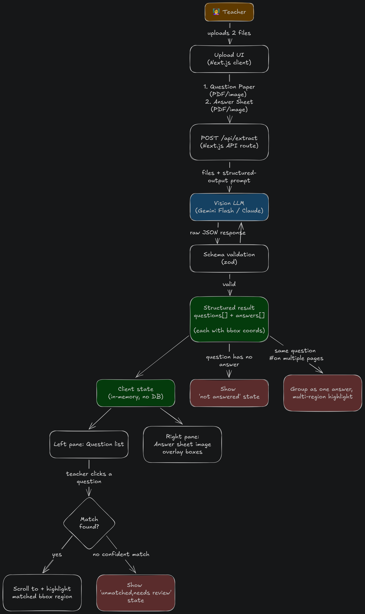

# VedaAI Assessment Extraction Pipeline

VedaAI is an automated grading and assessment extraction workspace. It processes uploaded printed question papers and handwritten student answer sheets, utilizing Vision Large Language Models (VLMs) to extract questions, map student responses, and provide highly accurate geometric bounding box coordinates for visual review.

## Core Technical Features

* **Multimodal Extraction:** Direct ingestion of PDF documents into VLMs without lossy intermediate OCR pipelines.
* **Strict Schema Enforcement:** Deterministic data parsing and structural enforcement utilizing Zod validation for all AI outputs.
* **Resilient Engine Fallbacks:** Primary dependency on Gemini Flash with an automatic, latency-aware fallback routing to Groq LLaMA models in high-demand (HTTP 503) scenarios.
* **Deterministic Display Rendering:** Client side rendering of PDF documents to canvas backed blob URLs via `pdfjs-dist`, ensuring absolute alignment for SVG coordinate overlays.

## Implementation Checklist

* [x] Scaffold Next.js App Router architecture and Tailwind CSS configuration
* [x] Build upload workspace for multi document ingestion (Question Paper and Answer Sheet)
* [x] Implement Next.js Server Action (`/app/actions.ts`) to bypass client payload limits
* [x] Integrate primary Gemini VLM extraction prompt logic
* [x] Construct Zod schemas for strict JSON response parsing and type safety
* [x] Develop resilient Groq fallback pipeline using `pdf-parse` for textual fallback
* [x] Build client side `pdfjs-dist` rendering engine for deterministic layout control
* [x] Develop dual pane workspace for data review and coordinate highlighting
* [x] Handle edge cases: Unanswered questions, out of order answers, and unmatched mappings
* [x] Establish architectural documentation and Architectural Decision Records (ADRs)

## Architecture and Engineering Decisions

This project follows strict engineering standards governed by Architectural Decision Records. The full technical architecture can be found in `docs/ARCHITECTURE.md`, and the decision logs in `docs/DECISIONS.md`.

### Rendering Strategy: pdfjs-dist vs. Native Browser PDF

A critical engineering decision was the bypass of native browser `<object>` or `<iframe>` PDF rendering. Native browser PDF widgets maintain isolated, internal scroll and zoom states that cannot be reliably tracked by the DOM. Overlaying absolute SVG bounding boxes over a native widget results in severe misalignment upon user interaction.

The implemented solution utilizes `pdfjs-dist` to render each PDF page client side into a standard HTML canvas element, subsequently converted to an immutable image blob URL. This ensures that the SVG coordinate system maps flawlessly to the document dimensions, persisting accurately across window resizing and scrolling.

### Strict Schema Enforcement

Vision LLMs are inherently stochastic. To guarantee interface stability, all model outputs are coerced into a structured JSON string and validated via Zod. The schema enforces:
1. `questions`: Array containing ID, text, and original sub part labels.
2. `mappings`: Array of student answers, confidence scores, AI feedback, and spatial coordinates.
3. `coordinates`: Array of normalized bounding boxes `[xmin, ymin, xmax, ymax, page]` to support single and multi page spanning answers.

### High Availability and Resilient Fallbacks

Relying on a single AI provider introduces a single point of failure. The extraction pipeline implements a cascading fallback system. If the primary Gemini model cluster returns a 503 Service Unavailable error due to high demand, the system automatically routes the documents through a secondary pipeline:
1. It processes the raw PDF buffers via `pdf-parse` to extract clean text.
2. It routes the text to a high capacity LLaMA model on the Groq network.
3. It maps the output back into the required Zod schema to prevent UI disruption.

## Optimization and Tradeoffs for Vision LLMs

**Optimization:** We feed raw PDF byte buffers directly into the Gemini model. Bypassing a traditional OCR pre processing step significantly reduces end to end latency and preserves complex spatial relationships (like handwritten diagrams or inline marginalia) that text only OCR destroys.

**Tradeoff:** Direct VLM ingestion increases the token payload size per request. To mitigate timeouts on large documents, we implemented a 60 second request timeout and established the secondary text only Groq pipeline. The Groq pipeline trades spatial bounding box accuracy for guaranteed uptime during VLM cluster outages.

## Documentation

* `[docs/ARCHITECTURE.md`](https://github.com/tsvlgd/veda-ai-assessment-grading/tree/main/docs): Core technical architecture and data flow.
* `[docs/DECISIONS.md`](https://github.com/tsvlgd/veda-ai-assessment-grading/tree/main/docs)`: Architectural Decision Records (ADRs).
